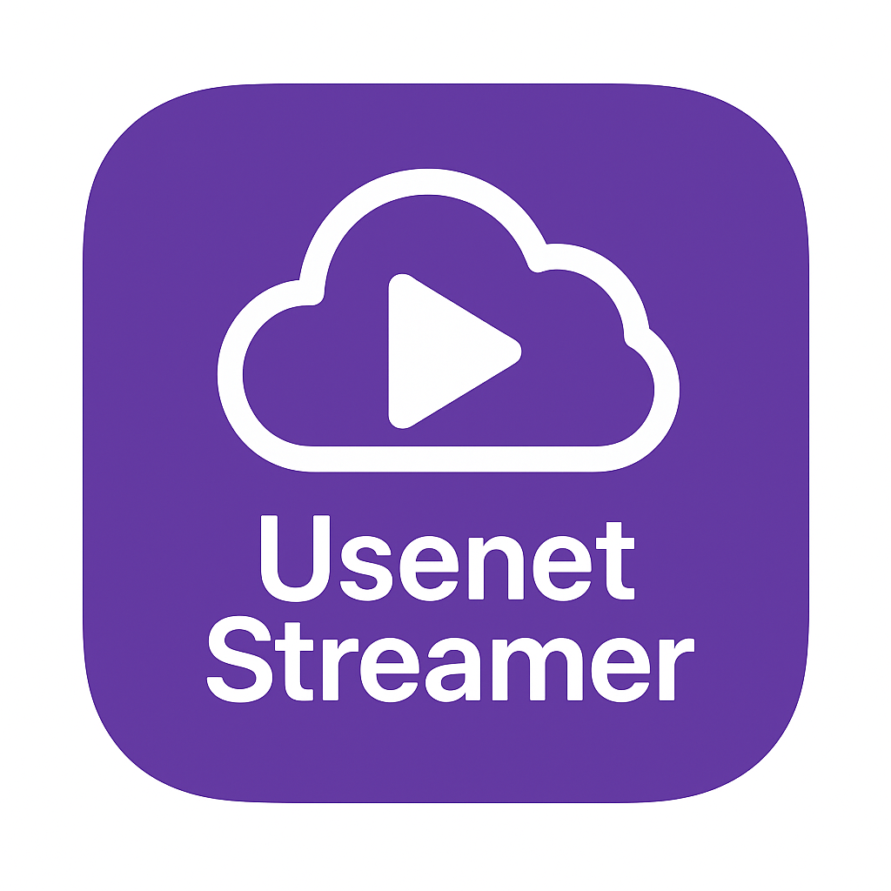

# UsenetStreamer



UsenetStreamer is a Stremio addon that bridges a Usenet indexer manager (Prowlarr or NZBHydra) and NZBDav. It hosts no media itself; it simply orchestrates search and streaming through your existing Usenet stack. The addon searches Usenet indexers through the manager, queues NZB downloads in NZBDav, and exposes the resulting media as Stremio streams.

## Features

- ID-aware search plans (IMDb/TMDB/TVDB) with automatic metadata enrichment.
- Parallel Prowlarr/NZBHydra queries with deduplicated NZB aggregation.
- Direct WebDAV streaming from NZBDav (no local mounts required).
- Configurable via environment variables (see `.env.example`).
- Fallback failure clip when NZBDav cannot deliver media.

## Getting Started

1. Copy `.env.example` to `.env` and fill in your indexer manager (Prowlarr or NZBHydra), NZBDav credentials, and addon base URL.
2. Install dependencies:

   ```bash
   npm install
   ```

3. Start the addon:

   ```bash
   node server.js
   ```

### Docker Usage

The image is published to the GitHub Container Registry. Pull it and run with your environment variables:

```bash
docker pull ghcr.io/sanket9225/usenetstreamer:latest

docker run -d \
   --name usenetstreamer \
   -p 7000:7000 \
   -e INDEXER_MANAGER=prowlarr \
   -e INDEXER_MANAGER_URL=https://your-prowlarr-host:9696 \
   -e INDEXER_MANAGER_API_KEY=your-prowlarr-api-key \
   -e INDEXER_MANAGER_INDEXERS=-1 \
   -e NZBDAV_URL=http://localhost:3000 \
   -e NZBDAV_API_KEY=your-nzbdav-api-key \
   -e NZBDAV_WEBDAV_URL=http://localhost:3000 \
   -e NZBDAV_WEBDAV_USER=webdav-username \
   -e NZBDAV_WEBDAV_PASS=webdav-password \
   -e ADDON_BASE_URL=https://myusenet.duckdns.org \
   ghcr.io/sanket9225/usenetstreamer:latest
```

If you prefer to keep secrets in a file, use `--env-file /path/to/usenetstreamer.env` instead of specifying `-e` flags.

> Need a custom build? Clone this repo, adjust the code, then run `docker build -t usenetstreamer .` to create your own image.

Using NZBHydra instead? Set `INDEXER_MANAGER=nzbhydra`, point `INDEXER_MANAGER_URL` at your Hydra instance, and provide comma-separated indexer names via `INDEXER_MANAGER_INDEXERS` if you want to limit the search scope. Leave `INDEXER_MANAGER_INDEXERS` blank to let Hydra decide.


## Environment Variables

- `INDEXER_MANAGER`, `INDEXER_MANAGER_URL`, `INDEXER_MANAGER_API_KEY`, `INDEXER_MANAGER_STRICT_ID_MATCH`, `INDEXER_MANAGER_INDEXERS`
- `NZBDAV_URL`, `NZBDAV_API_KEY`, `NZBDAV_WEBDAV_URL`, `NZBDAV_WEBDAV_USER`, `NZBDAV_WEBDAV_PASS`
- `ADDON_BASE_URL`

`INDEXER_MANAGER` defaults to `prowlarr`. Set it to `nzbhydra` to target an NZBHydra instance.

`INDEXER_MANAGER_STRICT_ID_MATCH` defaults to `false`. Set it to `true` if you want strictly ID-based searches (IMDb/TVDB/TMDB only). This usually yields faster, more precise matches but many indexers do not support ID queries, so you will receive fewer total results.

`INDEXER_MANAGER_INDEXERS` accepts a comma-separated list. For Prowlarr, use indexer IDs (e.g. `1,3,9`; `-1` means “all Usenet indexers”). For NZBHydra, provide the indexer names as displayed in its UI. The addon logs the effective value on each request.

`INDEXER_MANAGER_CACHE_MINUTES` (optional) overrides the default NZBHydra cache duration (10 minutes). Leave unset to keep the default. Prowlarr ignores this value.

See `.env.example` for the authoritative list.

### Choosing an `ADDON_BASE_URL`

`ADDON_BASE_URL` must be a **public HTTPS domain** that points to your addon deployment. Stremio refuses insecure origins, so you must front the addon with TLS before adding it to the catalog. DuckDNS + Let's Encrypt is an easy path, but any domain/CA combo works.

1. **Grab a DuckDNS domain (free):**
   - Sign in at [https://www.duckdns.org](https://www.duckdns.org) with GitHub/Google/etc.
   - Choose a subdomain (e.g. `myusenet.duckdns.org`) and note the token DuckDNS gives you.
   - Run their update script (cron/systemd/timer) so the domain always resolves to your server’s IP.

2. **Serve the addon over HTTPS (non-negotiable):**
   - Place Nginx, Caddy, or Traefik in front of the Node server.
   - Issue a certificate:
     - **Let’s Encrypt** with certbot, lego, or Traefik’s built-in ACME integration for a trusted cert.
     - DuckDNS also provides an ACME helper if you prefer wildcard certificates.
   - Terminate TLS at the proxy and forward requests from `https://<your-domain>` to `http://127.0.0.1:7000` (or your chosen port).
   - Expose `/manifest.json`, `/stream/*`, `/nzb/*`, and `/assets/*`. Stremio will reject plain HTTP URLs.

3. **Update `.env`:** set `ADDON_BASE_URL=https://myusenet.duckdns.org` and restart the addon so manifests reference the secure URL. Stremio will only load the addon when `ADDON_BASE_URL` points to a valid HTTPS domain.

Tips:

- Keep port 7000 (or whichever you use) firewalled; let the reverse proxy handle public traffic.
- Renew certificates automatically (cron/systemd timer or your proxy’s auto-renew feature).
- If you deploy behind Cloudflare or another CDN, ensure WebDAV/body sizes are allowed and HTTPS certificates stay valid.
- Finally, add `https://myusenet.duckdns.org/manifest.json` (replace with your domain) to Stremio’s addon catalog. Use straight HTTPS—the addon will not show up over HTTP.
