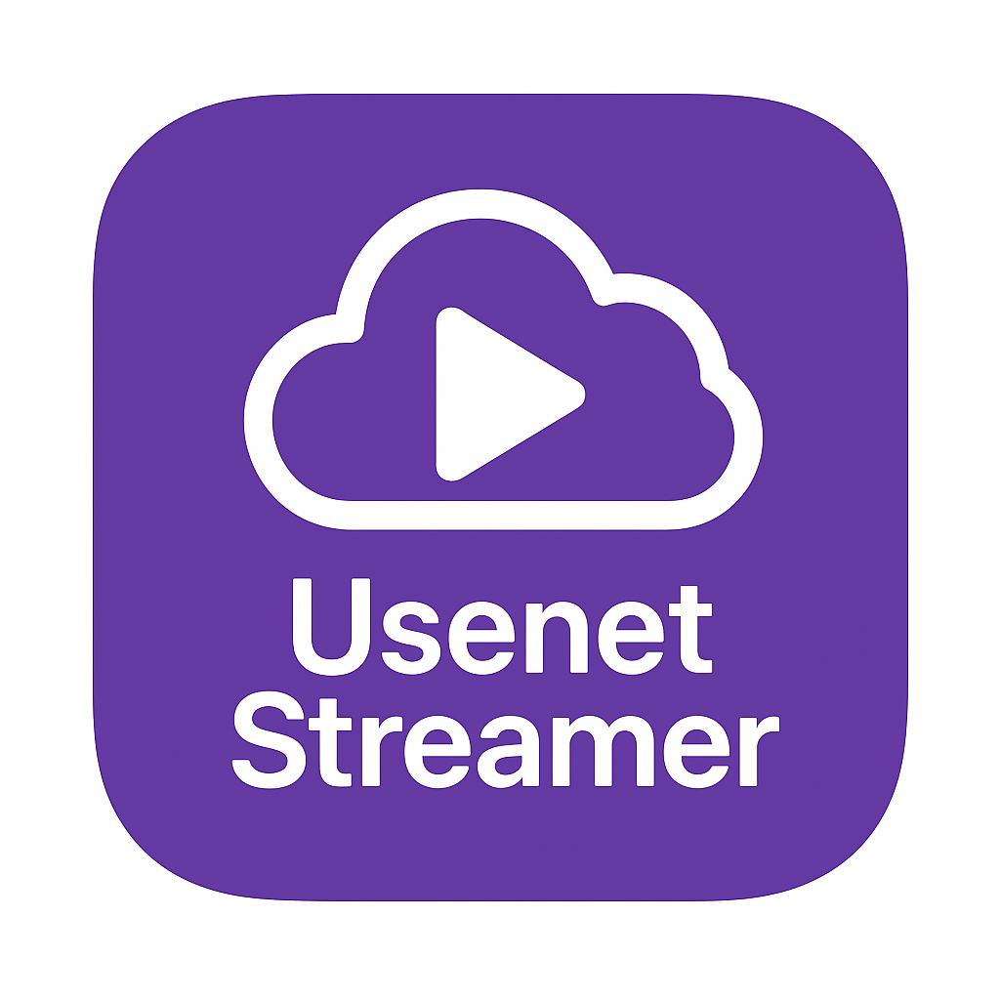

# UsenetStreamer

<p align="center">
  
</p>

<p align="center">
  <strong>Your Usenet-powered bridge between Prowlarr/NZBHydra, NZBDav, and Stremio.</strong><br />
  Query your favorite indexers, stream directly over WebDAV, and manage it all from a friendly web dashboard.
</p>

<p align="center">
  <a href="https://discord.gg/tUwNjXSZZN"></a>
  <a href="https://buymeacoffee.com/gaikwadsank"></a>
  <a href="https://github.com/Sanket9225/UsenetStreamer/actions"></a>
  <a href="https://ghcr.io/sanket9225/usenetstreamer"></a>
</p>

---

## 🔗 Quick Links

- **Docker image:** `ghcr.io/sanket9225/usenetstreamer:latest`
- **Admin dashboard:** `https://your-addon-domain/<token>/admin/`
- **Manifest template:** `https://your-addon-domain/<token>/manifest.json`
- **Discord:** [Community chat](https://discord.gg/tUwNjXSZZN)
- **Support:** [Buy me a coffee](https://buymeacoffee.com/gaikwadsank)
- **Self-hosting guide:** [Jump to instructions](#-deployment)

---

> **Disclaimer:** UsenetStreamer is not affiliated with any Usenet provider or indexer, does not host or distribute media, and is offered strictly for educational purposes.

## ☕ Support Development

**[Buy Me A Coffee &rarr;](https://buymeacoffee.com/gaikwadsank)** — every cup keeps the addon maintained, hosted, and packed with new features.

---

## ✨ Feature Highlights

### 🆕 Recent Enhancements (1.3.x → 1.4.x)
- **Background repair on truncation** — when a corrupt NZB truncates mid-stream, UsenetStreamer immediately searches for a replacement and queues it to nzbdav2, so the next stream list view shows a new ⚡ Instant option without any manual action.
- **Smarter dedupe pipeline** — collapses near-identical releases using normalized titles, indexer IDs, and sizes, so stream rows stay tidy even with aggressive multi-indexer searches.
- **Multi-language preferences** — pick several preferred audio languages in the admin panel; the sorter surfaces hits with 🌐 badges and falls back gracefully when none match.
- **Two-tier sorting polish** — quality/size ordering got revamped so languages, instant hits, and per-quality limits all blend without bouncing streams around between refreshes.
- **Per-resolution caps** — optionally limit the number of 4K/1080p/etc. streams kept before the next tier is considered, preventing walls of similar releases.
- **Retry-friendly triage** — if every NZB in the first pass fails health checks, the next manifest request transparently samples fresh candidates so you’re not stuck with a dead cache.
- **Built-in Easynews bridge** — native username/password fields expose Easynews as another indexer, no Flask proxy needed, and streams skip NNTP triage while staying marked ✅.
- **Curated Newznab presets** — enable the new built-in indexers list to bootstrap direct APIs quickly (paid flag doubles as health-check eligibility).
- **Cleaner stream formatting** — manifest responses now display consistent title, badge, and language lines across desktop/mobile Stremio.

### 🚀 Performance & Caching
- Parallel queries to Prowlarr or NZBHydra with automatic deduplication.
- Two-tier cache (Stremio responses + verified NZBs) to keep repeat requests instant.
- Configurable TTLs and size limits so you can tune memory usage for any server.

### 🔍 Smart Search & Language Filtering
- IMDb/TMDB/TVDB-aware search plans and TVDB-prefixed ID support (no Cinemeta needed).
- Release titles parsed for resolution, quality, and audio language, enabling `quality_then_size` or `language_quality_size` sorting.
- Preferred language groups (single or multiple) rise to the top and display with clear 🌐 labels.
- Optional dedupe filter (enabled by default) collapses identical releases; toggle it off to inspect every hit.
- A single per-quality cap (e.g., 4) keeps only the first few results for each resolution before falling back to the next tier.

### ⚡ Instant Streams from NZBDav
- Completed NZBDav jobs are recognized automatically and surfaced with a ⚡ tag.
- Instant streams are floated to the top of the list so you can start watching immediately.

### 🔌 Built-in Easynews Indexer
- Toggle Easynews in the admin panel, drop in your username/password, and get native search results without running the standalone proxy.
- Movies/series use strict Cinemeta matching for precise hits, while external text-only addons stay in loose mode.
- Easynews results skip triage (they're treated as ✅ verified) but still flow through the usual dedupe/sorting pipeline.

### 🩺 NNTP Health Checks
- Optional triage downloads a handful of NZBs, samples archives over NNTP, and flags broken uploads before Stremio sees them.
- Decisions are cached per download URL and per normalized title, so later requests inherit health verdicts instantly.

### 🔐 Secure-by-Default
- Shared-secret gate ensures only URLs with `/your-secret/` can load the manifest or streams.
- Admin dashboard, manifest, and stream endpoints all reuse the same token.

---

## 🗺️ How It Works

1. **Stremio request:** Stremio calls `/stream/<type>/<id>.json` (optionally with `?lang=de` or other hints).
2. **Indexer search:** UsenetStreamer plans IMDb/TMDB/TVDB searches plus fallbacks and queries Prowlarr/NZBHydra simultaneously.
3. **Release parsing:** Titles are normalized for resolution, size, and language; oversize files above your cap are dropped.
4. **Triage & caching (optional):** Health checks sample NZBs via NNTP; decisions and NZBs are cached.
5. **NZBDav streaming:** Chosen NZBs feed NZBDav, which exposes a WebDAV stream back to Stremio.
6. **Instant detection:** Completed NZBDav jobs are matched by normalized title and tagged ⚡ for instant playback.

---

## 🐳 Deployment

### Docker (recommended)

```bash
mkdir -p ~/usenetstreamer-config
docker run -d --restart unless-stopped \
  --name usenetstreamer \
  -p 7000:7000 \
  -e ADDON_SHARED_SECRET=super-secret-token \
  -e CONFIG_DIR=/data/config \
  -v ~/usenetstreamer-config:/data/config \
  ghcr.io/sanket9225/usenetstreamer:latest
```

#### Docker Compose

```yaml
services:
  usenetstreamer:
    image: ghcr.io/sanket9225/usenetstreamer:latest
    container_name: usenetstreamer
    restart: unless-stopped
    ports:
      - "7000:7000"
    environment:
      ADDON_SHARED_SECRET: super-secret-token
      CONFIG_DIR: /data/config
    volumes:
      - ./usenetstreamer-config:/data/config
```

Then browse to `https://your-domain/super-secret-token/admin/` to enter your credentials. The `CONFIG_DIR` variable tells the addon to store `runtime-env.json` under the mounted path so your admin settings survive container recreations. The container ships with Node 20, exposes port 7000, and supports both `linux/amd64` and `linux/arm64` thanks to `buildx`.

### Source installation

```bash
git clone https://github.com/Sanket9225/UsenetStreamer.git
cd UsenetStreamer
npm install
node server.js
```

Create `.env` (see `.env.example`) or, better, load `http://localhost:7000/<token>/admin/` to configure everything from the UI.

### Reverse proxy & HTTPS

Stremio requires HTTPS. Place Nginx/Caddy/Traefik in front of the addon, terminate TLS, and forward to `http://127.0.0.1:7000`. Expose `/manifest.json`, `/stream/*`, `/nzb/*`, `/assets/*`, and `/admin/*`. Update `ADDON_BASE_URL` accordingly.

---

## 🍼 Beginner-Friendly End-to-End Setup

Prefer a hand-held walkthrough? Read [`docs/beginners-guide.md`](docs/beginners-guide.md) for a soup-to-nuts tutorial that covers:

- Picking a Usenet provider + indexer, spinning up a VPS, and installing Docker.
- Deploying Prowlarr, NZBDav, and UsenetStreamer with a single `docker compose` file.
- Opening firewall ports, wiring DuckDNS, and configuring Caddy for HTTPS the beginner way.

Refer to that guide whenever you need a step-by-step checklist; the rest of this README focuses on day-to-day usage details.

## 🛠️ Admin Dashboard

Visit `https://your-addon-domain/<token>/admin/` to:

- Load and edit every runtime setting with validation and helpful hints.
- Trigger connection tests for indexer manager, NZBDav, and NNTP provider.
- Copy the ready-to-use manifest URL right after saving.
- Restart the addon safely once changes are persisted.

The dashboard is protected by the same shared secret as the manifest. Rotate it if you ever suspect exposure.

---

## ⚙️ Configuration & Environment Variables *(prefer the admin dashboard)*

- `INDEXER_MANAGER` (default `prowlarr`) — set `nzbhydra` for Hydra.
- `INDEXER_MANAGER_URL`, `INDEXER_MANAGER_API_KEY`, `INDEXER_MANAGER_INDEXERS`, `INDEXER_MANAGER_STRICT_ID_MATCH`.
- `ADDON_BASE_URL` (must be HTTPS), `ADDON_SHARED_SECRET` (required for security).
- `NZB_SORT_MODE` (`quality_then_size` or `language_quality_size`), `NZB_PREFERRED_LANGUAGE` (comma-separated to prioritize multiple languages), `NZB_MAX_RESULT_SIZE_GB` (defaults to 30 GB, set 0 for no cap), `NZB_DEDUP_ENABLED` (collapse duplicate releases by title/indexer/size), `NZB_ALLOWED_RESOLUTIONS` (whitelist of qualities to keep), `NZB_RESOLUTION_LIMIT_PER_QUALITY` (optional uniform cap; e.g. `4` keeps at most four streams for each enabled resolution).
- `NZBDAV_URL`, `NZBDAV_API_KEY`, `NZBDAV_WEBDAV_URL`, `NZBDAV_WEBDAV_USER`, `NZBDAV_WEBDAV_PASS`, `NZBDAV_CATEGORY*`.
- `EASYNEWS_ENABLED`, `EASYNEWS_USERNAME`, `EASYNEWS_PASSWORD` — enable the built-in Easynews search bridge (text-only search with optional strict matching).
- `NZBDAV_HISTORY_FETCH_LIMIT`, `NZBDAV_CACHE_TTL_MINUTES` (controls instant detection cache).
- `NZB_TRIAGE_*` for NNTP health checks (host, port, user/pass, timeouts, candidate counts, reuse pool, etc.).

See `.env.example` for the complete list and defaults.

---

## 🧠 Advanced Capabilities

### Language-based ordering
- Switch to `language_quality_size` sorting to pin one or more preferred languages (set via dashboard or `NZB_PREFERRED_LANGUAGE=English,Tamil`).
- Matching releases get a ⭐ tag plus `🌐 <Language>` badges, but non-matching streams stay available.

### Instant cache awareness
- Completed NZBDav titles and still-mounted NZBs are resolved by normalized titles.
- Instant streams jump to the top of the response and are logged in Stremio metadata (`cached`, `cachedFromHistory`).

### Health triage decisions
- Triage can mark NZBs `✅ verified`, `⚠️ unverified`, or `🚫 blocked`, reflected in stream tags.
- Approved samples optionally store NZB payloads in memory, letting NZBDav mount them without re-fetching.

---

## 🖥️ Platform Compatibility

| Platform | Status |
| --- | --- |
| Stremio 4.x desktop (Win/Linux) | ✅ Tested |
| Stremio 5.x beta | ✅ Tested |
| Android TV / Mobile | ✅ Tested |
| iOS via Safari/TestFlight | ✅ Tested |
| Web (Chromium-based browsers) | ✅ Tested |
| tvOS / Apple TV (Omni/Vidi/Fusion) | ✅ Reported working |

Anything that can load HTTPS manifests and handle `externalPlayer` hints should work. Open an issue or drop by Discord if you hit a platform-specific quirk.

---

## 📝 Changelog

### [next] - 2026-04-12
- Upstream sync: NNTP pool hang-up fix — reduce default connections to 12, add 15s acquire timeout and 30s prewarm timeout, require fresh pool on stale builder (upstream 392770c)
- Upstream sync: security hardening — header allowlist on NZBDav proxy, error URL sanitization, credential masking for admin API, failed-login lockout (10 attempts / 15min), CSRF Origin checking, runtime-env.json file permissions (upstream 3e75d88+e473adc)
- Upstream sync: extended attributes — request extended=1 from Newznab, parse files/grabs/group/usenetdate, fix Easynews post date field, date/files sort criteria, dedup uses title+group bucket key and prefers fewer-files releases (upstream 004ed78+b8fb0dd+b3ea762)
- Upstream sync: NZBDav stream caching — HTTP keep-alive agents, file size cache (30min TTL), real HEAD requests instead of GET+Range:0-0 emulation, cached HEAD fast-path, server keepAliveTimeout/headersTimeout (upstream e19c375)
- Upstream sync: indexer caps filtering — caps infrastructure with per-indexer supportedParams cache, skip indexers missing required ID params (imdbid/tvdbid/tmdbid), filter unsupported tokens from search plans (upstream e6da82e+66e917a)
- Upstream sync: pin axios to 1.14.0 for reproducible builds (upstream 202145b)
- Feature: configurable stream naming template system — rich multi-line Stremio stream cards with resolution, source, codec, visual tags, size, indexer, and health status; customizable via NZB_NAMING_PATTERN and NZB_DISPLAY_NAME_PATTERN env vars
- Feature: visual stream display builder in admin dashboard — drag-and-drop token ordering, enable/disable toggles, line break separators, and live preview for stream naming pattern configuration

### [prev] - 2026-04-03
- Fix: mid-stream truncation fallback — corrupt Usenet segments (YENC CRC failures) now mark the download URL in the negative cache so Stremio's automatic retry routes to a fallback NZB instead of hitting the same corrupt file repeatedly

---

## 🤝 Support & Community

- **Discord:** [Join the chat](https://discord.gg/tUwNjXSZZN)
- **Buy me a coffee:** [Keep development humming](https://buymeacoffee.com/gaikwadsank)
- **Issues & PRs:** [GitHub tracker](https://github.com/Sanket9225/UsenetStreamer/issues)

Huge thanks to everyone testing, filing bugs, and sharing feature ideas.
